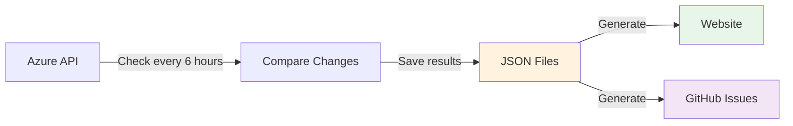

# Azure AI Foundry Model Availability Tracker

Automatically track which Azure AI models are available in which regions. Get notified when new models or regions become available.

**View Live Dashboard**: [https://JinLee794.github.io/foundry-model-availability-notifications](https://JinLee794.github.io/foundry-model-availability-notifications)

## What Does This Do?

This project monitors Azure AI Foundry and:

- Checks model availability every 6 hours
- Detects when new models or regions are added/removed
- Creates GitHub issues to notify you of changes
- Publishes an interactive website showing all available models

## How It Works



### Simple Explanation

1. **GitHub Actions runs every 6 hours**
   - Fetches current model data from Azure
   - Compares it to the previous snapshot

2. **If changes are detected:**
   - Saves the new data to `.region-watch/regions_snapshot.json`
   - Records the change in `.region-watch/history/`
   - Creates a GitHub issue describing what changed

3. **Website is automatically updated:**
   - Reads the JSON data files
   - Generates markdown pages with tables and filters
   - Builds a static site with MkDocs
   - Deploys to GitHub Pages

### The Data is the Source of Truth

Everything comes from the JSON files in `.region-watch/`:

- `regions_snapshot.json` - Current state of all models
- `history/diff-*.json` - Record of all changes over time

The website and notifications are just different ways to view this same data.

## Project Structure

```
├── .github/workflows/
│   ├── region-watch.yml       # Monitors Azure API every 6 hours
│   └── deploy-docs.yml        # Builds and deploys website
│
├── .region-watch/
│   ├── regions_snapshot.json  # Current model availability (source of truth)
│   ├── history/               # Historical changes
│   ├── diff_regions.py        # Detects changes
│   └── render_markdown.py     # Creates summary table
│
├── docs/                      # Generated website content
├── generate_docs.py           # Converts JSON to website pages
└── mkdocs.yml                 # Website configuration
```

## Quick Start

### View the Website

Visit [https://JinLee794.github.io/foundry-model-availability-notifications](https://JinLee794.github.io/foundry-model-availability-notifications)

### Run Locally

```bash
# Install dependencies
pip install mkdocs mkdocs-material

# Generate website pages from latest data
python generate_docs.py

# Preview the site at http://localhost:8000
mkdocs serve
```

### Run The Node.js Browser

```bash
# Install dependencies
npm install

# Start the local browser app
npm start
```

Then open `http://localhost:3000`.

The Node.js app reads `.region-watch/regions_snapshot.json` on every API request, so it reflects the latest snapshot file automatically.

### Agent / Diff API

The Node.js app now also exposes a machine-friendly compare endpoint:

```bash
GET /api/compare/latest
GET /api/views/primary
GET /api/europe/latest
GET /api/europe/flat
GET /api/europe/summary
GET /api/worldwide/latest
GET /api/worldwide/flat
GET /api/worldwide/summary
```

This returns:

- the latest refresh status
- whether the latest refresh had changes
- the last diff source used for comparison
- an `entries` array with `old` and `new` state per changed model
- direct `added` and `removed` regions per model and per SKU

For Europe-first integration there are dedicated endpoints, and Europe remains the primary/default scope:

- `GET /api/views/primary`: returns the primary scope metadata and the Europe payload first
- `GET /api/europe/latest`: the structured two-view Europe payload
- `GET /api/europe/flat`: flat JSON rows for automation and BI ingestion
- `GET /api/europe/summary`: summary metadata plus the markdown digest
- `GET /api/europe/summary?format=markdown`: raw markdown summary for daily showcase pages or mail bodies
- `GET /api/worldwide/latest`: the structured worldwide payload
- `GET /api/worldwide/flat`: flat worldwide rows for automation and BI ingestion
- `GET /api/worldwide/summary`: summary metadata plus the worldwide markdown digest
- `GET /api/worldwide/summary?format=markdown`: raw markdown summary for global reporting

If the latest refresh has no changes, the endpoint automatically falls back to the latest historical diff so an agent can still show the last meaningful change.

### Manually Check for Changes

For local development on OneDrive or SharePoint-synced folders, keep your Python virtual environment outside the synced project tree. Packages like `certifi` include public CA bundles as `.pem` files, which can trigger sensitive-data scans even though they are not project secrets.

```bash
# Install dependencies
pip install -r requirements.txt

# Check current availability and detect changes
python .region-watch/diff_regions.py > region_diff.json

# View the changes
cat region_diff.json
```

This generates Europe-first artifacts plus a worldwide companion view:

- `region_diff_europe.json` - Europe-only JSON with two views:
   - `views.by_model`: model-first view with filtered available regions and update deltas
   - `views.by_region`: datacenter/region-first view with filtered available models and update deltas
- `region_diff_europe_flat.json` - flat Europe rows for downstream automation, warehousing, or BI ingestion
- `region_diff_europe_summary.md` - daily markdown digest for reporting, issue bodies, mailers, or portals
- `region_diff_worldwide.json` - worldwide JSON with the same two-view structure
- `region_diff_worldwide_flat.json` - flat worldwide rows for downstream automation, warehousing, or BI ingestion
- `region_diff_worldwide_summary.md` - worldwide markdown digest for global reporting

## Does The Data Stay Updated?

Yes, but there are two separate steps:

- `.region-watch/diff_regions.py` is the script that fetches the current availability data from the Azure docs sources and writes `.region-watch/regions_snapshot.json`.
- `generate_docs.py` does **not** fetch fresh availability. It only regenerates the markdown site from the existing snapshot.

In GitHub, `.github/workflows/region-watch.yml` runs on a schedule every 6 hours at `0 */6 * * *`, refreshes the snapshot, detects changes, commits the updated files, and raises an issue when something changed.

For local use, the new Node.js app stays in sync with whatever is currently in `.region-watch/regions_snapshot.json`, but it does not pull fresh data by itself. To refresh locally, run `.region-watch/diff_regions.py` again or pull the latest repository changes.

## What Gets Generated

### Website Pages

- **Home** - Overview and quick stats
- **All Models** - Searchable table of all models
- **By Region** - Filter by Azure region
- **By SKU Type** - Filter by deployment type (Standard, Provisioned, etc.)
- **Change History** - Timeline of all availability changes
- **Individual Model Pages** - Detailed view for each model

### Notifications

When changes are detected, a GitHub issue is automatically created with:

- Summary of what changed
- List of added/removed regions per model
- Link to the website for full details

**Get Notified Automatically:**

To receive notifications when model availability changes:

1. Watch this repository (click "Watch" at the top)
2. Choose `Custom`
3. Enable `Issues`
4. You'll get notified whenever a new `region-watch` issue is created

**Tag Specific Users:**

You can configure automatic mentions by setting the `ISSUE_ASSIGNEES` environment variable in the workflow:

```yaml
# In .github/workflows/region-watch.yml
- name: Notify via GitHub issue
  env:
    ISSUE_ASSIGNEES: "user1,user2,user3"  # Add this line
```

This will automatically assign and notify specific team members when changes are detected

**Try A Demo In GitHub:**

Use the workflow `.github/workflows/diff-notifier.yml` from the GitHub Actions UI.

It creates a demo issue from the latest historical diff file so you can preview the exact GitHub notification experience without waiting for the next real refresh.

## Key Files Explained

| File | Purpose |
|------|---------|
| `.region-watch/regions_snapshot.json` | **The source of truth** - Current state of all models |
| `.region-watch/diff_regions.py` | Fetches data from Azure and compares to snapshot |
| `generate_docs.py` | Reads JSON and creates markdown pages |
| `mkdocs.yml` | Configures the website theme and navigation |
| `.github/workflows/region-watch.yml` | Runs the monitoring every 6 hours |
| `.github/workflows/deploy-docs.yml` | Builds and publishes the website |
| `ADDING_NEW_MODELS.md` | Guide for adding support for additional model families |

## Supported Models

Currently tracking models from multiple Azure AI model families:

**OpenAI models:**
- GPT-4, GPT-4o, GPT-3.5 Turbo
- o1, o3, o4 series
- DALL-E 3, Whisper, TTS
- Text embeddings (ada-002, text-embedding-3)

**Foundry models:**
- Phi (Microsoft's small language models)
- Mistral (Mistral AI models)
- Qwen (Alibaba's models)
- gpt-oss (OpenAI's open-weight models)
- Other models from the Azure AI Foundry catalog

**Default behavior:** All models from all configured sources are included by default to provide comprehensive information in the mkdocs pages.

**Want to add more sources?** See [ADDING_NEW_MODELS.md](ADDING_NEW_MODELS.md) for instructions.

## Workflows

### Monitoring Workflow

**File**: `.github/workflows/region-watch.yml`

**When it runs:**

- Every 6 hours automatically
- Manually via GitHub Actions UI

**What it does:**

1. Fetch current model data from Azure
2. Compare to previous snapshot
3. Save new snapshot
4. Create GitHub issue if changes found
5. Trigger website rebuild

### Documentation Workflow

**File**: `.github/workflows/deploy-docs.yml`

**When it runs:**

- After monitoring workflow completes
- When you edit docs files
- Manually via GitHub Actions UI

**What it does:**

1. Run `generate_docs.py` to create pages
2. Build static site with MkDocs
3. Deploy to GitHub Pages

## Customization

### Change Monitoring Frequency

Edit `.github/workflows/region-watch.yml`:

```yaml
on:
  schedule:
    - cron: "23 */6 * * *"  # Change to your preferred schedule
```

### Modify Website Theme

Edit `mkdocs.yml` to change colors, features, or navigation.

### Add Custom Pages

Add your own markdown files to `docs/` and reference them in `mkdocs.yml` navigation.

## Why This Architecture?

**Separate data from presentation:**

- JSON files = reliable data storage
- Website = one way to view the data
- Could add other UIs (CLI tool, Slack bot, etc.) using the same data

**Automatic and hands-off:**

- GitHub Actions handles everything
- No servers to maintain
- Free hosting on GitHub Pages

**Transparent history:**

- All changes are committed to git
- Full audit trail of what changed when
- Can recreate website from any point in history
